# RouteGuard

A Django-based logistics planning application for managing drivers, routes, and scheduling.

## Table of Contents

- [RouteGuard](#routeguard)
  - [Table of Contents](#table-of-contents)
  - [Live Application](#live-application)
  - [Overview](#overview)
  - [Project Purpose](#project-purpose)
  - [Target Users](#target-users)
  - [User Experience](#user-experience)
  - [User Stories](#user-stories)
    - [Core User Stories](#core-user-stories)
    - [Availability \& Validation](#availability--validation)
    - [Feedback \& Risk](#feedback--risk)
  - [Data Model](#data-model)
    - [Driver](#driver)
    - [Route](#route)
    - [Availability](#availability)
    - [Assignment](#assignment)
    - [Relationships](#relationships)
  - [Features](#features)
  - [Screenshots](#screenshots)
    - [Homepage](#homepage)
    - [Driver Management](#driver-management)
    - [Route Management](#route-management)
    - [Availability Management](#availability-management)
    - [Assignment Management](#assignment-management)
    - [Record Creation Form](#record-creation-form)
    - [Edit Functionality](#edit-functionality)
    - [Delete Confirmation](#delete-confirmation)
    - [Authentication](#authentication)
  - [Data Flow and Application Logic](#data-flow-and-application-logic)
  - [Future Features](#future-features)
  - [Technologies Used](#technologies-used)
  - [Testing](#testing)
    - [Functional Testing](#functional-testing)
    - [Data Rendering Testing](#data-rendering-testing)
    - [UI Testing](#ui-testing)
    - [Error Handling](#error-handling)
    - [Form Submission Testing](#form-submission-testing)
    - [Assignment Validation Testing](#assignment-validation-testing)
    - [Update Functionality Testing](#update-functionality-testing)
    - [Delete Functionality Testing](#delete-functionality-testing)
    - [Availability CRUD Testing](#availability-crud-testing)
    - [User Feedback Testing](#user-feedback-testing)
    - [UI Polish Testing](#ui-polish-testing)
    - [Authentication Testing](#authentication-testing)
    - [Live Deployment Testing](#live-deployment-testing)
    - [HTML Validation](#html-validation)
    - [CSS Validation](#css-validation)
    - [Lighthouse Testing](#lighthouse-testing)
  - [Deployment](#deployment)
    - [Deployment Steps](#deployment-steps)
      - [Environment Variables](#environment-variables)
      - [Notes](#notes)
  - [Credits](#credits)
  - [Challenges Faced \& Solutions](#challenges-faced--solutions)
    - [Template Structure and Inheritance Issues](#template-structure-and-inheritance-issues)
    - [Static Files Not Loading](#static-files-not-loading)
    - [File Structure Organisation](#file-structure-organisation)
    - [URL Routing Configuration](#url-routing-configuration)
    - [Template Rendering Output Issues](#template-rendering-output-issues)
    - [Key Learning Outcomes](#key-learning-outcomes)
    - [Data Not Displaying in Templates](#data-not-displaying-in-templates)
    - [Missing Form Import in View](#missing-form-import-in-view)
    - [Missing Redirect Import in View](#missing-redirect-import-in-view)
    - [Form Handling and View Integration Issues](#form-handling-and-view-integration-issues)
    - [Edit View Errors and Debugging](#edit-view-errors-and-debugging)
      - [Issues encountered](#issues-encountered)
      - [How I fixed it](#how-i-fixed-it)
      - [Edit View Outcome](#edit-view-outcome)
    - [Availability Delete URL Error](#availability-delete-url-error)
    - [Incorrect Messages Import](#incorrect-messages-import)
      - [Messages Import Outcome](#messages-import-outcome)
  - [Additional Deployment Challenges](#additional-deployment-challenges)
    - [Deployment Issue: Missing `dj_database_url`](#deployment-issue-missing-dj_database_url)
    - [Deployment Issue: Virtual Environment Included in Repository](#deployment-issue-virtual-environment-included-in-repository)
    - [Deployment Issue: Static Files Configuration Error](#deployment-issue-static-files-configuration-error)
    - [Deployment Issue: Gunicorn Not Installed](#deployment-issue-gunicorn-not-installed)
    - [Deployment Issue: Missing WhiteNoise Dependency](#deployment-issue-missing-whitenoise-dependency)
    - [Deployment Issue: Application Crash After Successful Build](#deployment-issue-application-crash-after-successful-build)
  - [Deployment Insight](#deployment-insight)
  - [Conclusion](#conclusion)

## Live Application

The deployed application can be accessed here:

[RouteGuard Live Site](https://routeguard-4a6f16cc8505.herokuapp.com/)

---

## Overview

RouteGuard is a full-stack Django web application designed to support logistics planning by managing drivers, routes, availability, and assignments.

The system allows users to create and manage a shared dataset, ensuring that drivers are assigned efficiently while avoiding scheduling conflicts and highlighting potential planning risks.

---

## Project Purpose

The purpose of RouteGuard is to provide a centralised system for managing logistics planning data that is often handled through fragmented tools such as spreadsheets, messaging platforms, or internal systems.

This application aims to:

- Improve visibility of driver availability
- Prevent scheduling conflicts
- Provide simple feedback on assignment risk
- Streamline the planning process

The project is inspired by real-world logistics operations, where planning efficiency and compliance are critical.

---

## Target Users

RouteGuard is designed for:

- Logistics planners
- Transport coordinators
- Operations teams managing driver schedules

These users require a system that allows them to:

- Manage driver availability
- Assign routes efficiently
- Avoid double bookings
- Monitor workload and risk

---

## User Experience

The application is designed with simplicity and clarity in mind:

- A clear navigation structure allows users to easily move between drivers, routes, and assignments
- Forms are used for creating and updating records
- Immediate feedback is provided after actions (e.g. success messages, validation errors)
- The layout is responsive and accessible across different screen sizes
- Colour indicators (green, amber, red) provide intuitive feedback on assignment risk
- Data is displayed in structured tables to improve clarity and usability
- Users can create new records directly from the interface without using the admin panel
- Users receive immediate visual feedback through updated tables after submitting data
- Shared styling was applied across navigation, tables, forms, and messages to improve visual consistency
- Brief descriptive text was added to key pages to help users understand the purpose of each section

The goal is to ensure that users can perform tasks quickly without confusion.

---

## User Stories

### Core User Stories

- As a user, I want to create and manage drivers so that I can maintain an up-to-date workforce list
- As a user, I want to create and manage routes so that I can define available work
- As a user, I want to assign drivers to routes so that work can be scheduled efficiently
- As a user, I want to view all assignments so that I can monitor planned work
- As a user, I want to update or delete records so that data remains accurate

### Availability & Validation

- As a user, I want to mark drivers as available, resting, or on holiday so that I can plan accurately
- As a user, I want to prevent assigning unavailable drivers so that scheduling errors are avoided
- As a user, I want to prevent assigning a driver to overlapping routes so that double-booking does not occur
- As a user, I want to prevent drivers being assigned more than once on the same day so that duplicate daily bookings do not occur

### Feedback & Risk

- As a user, I want to receive feedback when creating assignments so that I understand whether the action was successful
- As a user, I want to see a simple risk indicator (green, amber, red) so that I can identify potential scheduling issues

---

## Data Model

The application is built using a relational database with the following core models:

### Driver

- Stores driver information such as name and status

### Route

- Stores route details including destination and estimated duration

### Availability

- Records driver availability on specific dates (available, rest, holiday, etc.)

### Assignment

- Links drivers to routes with a date and time
- Used to track planned work and calculate scheduling risk

### Relationships

- A driver can have many availability records
- A driver can have many assignments
- A route can be assigned multiple times
- Each assignment links one driver to one route

---

## Features

- Full CRUD functionality for Drivers, Routes, Availability, and Assignments
- Frontend forms built using Django ModelForms to allow users to create records without using the admin panel
- Dynamic data rendering from the database using Django views and templates
- Navigation links between all key data pages (Drivers, Routes, Assignments, Availabilities)
- Data displayed in structured table layouts for improved readability and usability
- Automatic redirection after successful form submission to improve user workflow
- Validation to support data integrity, including prevention of duplicate driver records and scheduling conflicts
- Responsive layout using HTML and CSS
- Admin panel for backend data management
- Assignment validation to prevent duplicate same-day driver bookings
- Frontend edit functionality for updating existing records
- Frontend delete functionality with confirmation pages to reduce accidental data removal
- Frontend edit and delete functionality for availability records with confirmation pages
- User feedback messages displayed after create, update, and delete actions to improve user experience
- Consistent styling applied across CRUD pages for improved readability and usability
- Success messages displayed clearly after create, update, and delete actions
- User authentication with signup, login, and logout functionality
- Protected create, update, and delete views so only authenticated users can modify data

---

## Screenshots

### Homepage

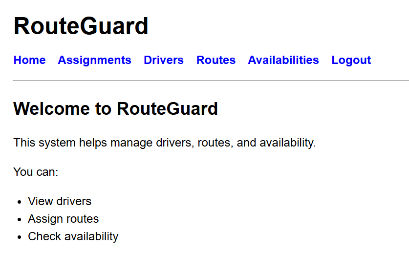

The homepage introduces RouteGuard and provides access to the main areas of the application.

### Driver Management

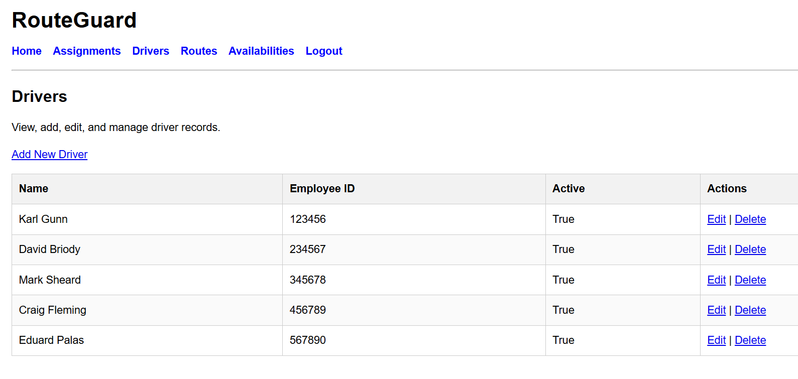

The driver page displays driver records and provides create, edit, and delete functionality.

### Route Management

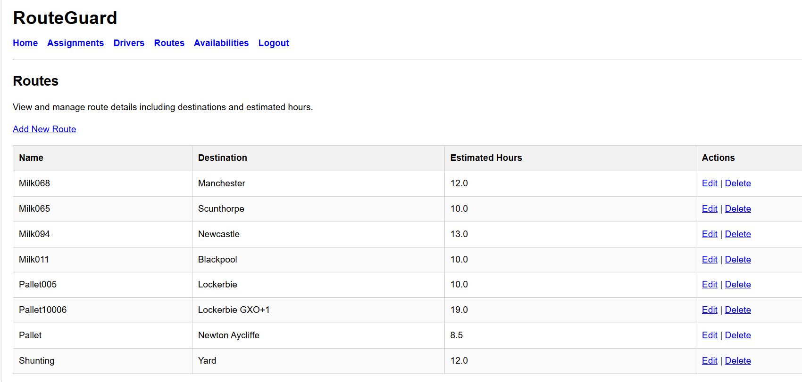

The route page allows users to manage route details including destination and estimated hours.

### Availability Management

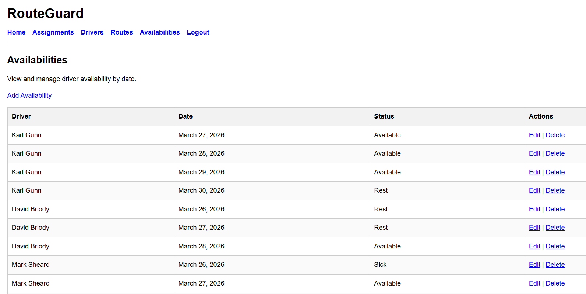

The availability page allows users to record and manage driver availability by date and status.

### Assignment Management

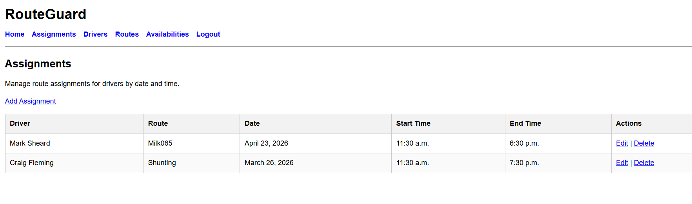

The assignment page shows driver-route assignments and displays key scheduling information.

### Record Creation Form

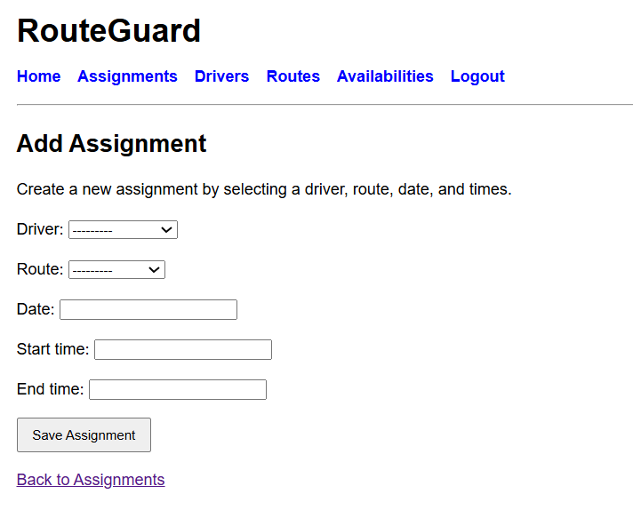

Frontend forms allow users to create records directly from the application.

### Edit Functionality

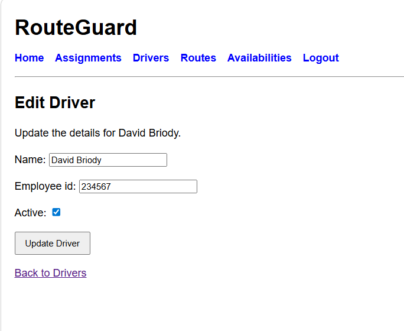

Existing records can be updated through pre-filled edit forms.

### Delete Confirmation

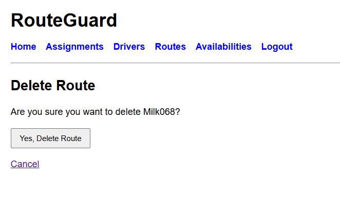

Delete confirmation pages help prevent accidental removal of records.

### Authentication

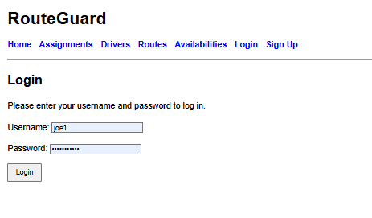

User authentication was implemented to protect restricted functionality.

---

## Data Flow and Application Logic

The application follows Django’s Model-View-Template (MVT) architecture:

- **Models** define the database structure and relationships
- **Views** retrieve and process data from the database
- **Templates** render data dynamically for the user

User interactions follow this flow:

1. A user submits a form (e.g. create driver, route, availability or assignment)
2. The view processes the request and validates the data
3. If valid, the data is saved to the database
4. The user is redirected to a list page where updated data is displayed

This structure ensures clear separation of concerns and maintainable code.

---

## Future Features

- Drag-and-drop planning interface
- Advanced legal driving hours calculations
- Dashboard with analytics and summaries
- Multi-user roles (admin vs standard user)
- Integration with external logistics systems
- Exporting reports
- More advanced time-based validation, including rest-gap checks and cumulative driver-hours rules

---

## Technologies Used

- Python
- Django
- HTML
- CSS
- SQLite (development database)
- Git & GitHub (version control)
- Heroku (deployment)
- Django Forms (ModelForms for data input and validation)

---

## Testing

Manual testing was carried out throughout development to ensure functionality, usability, and data handling across the application.

### Functional Testing

- Verified that all models (Driver, Route, Availability, Assignment) could be created and viewed via the Django admin panel
- Confirmed that data stored in the database is correctly retrieved and displayed in templates
- Tested navigation links between pages to ensure correct routing

### Data Rendering Testing

- Ensured that data passed from views is correctly rendered in templates
- Tested scenarios where no data exists to confirm fallback messages (e.g. "No assignments have been added yet") display correctly
- Used temporary debug outputs (e.g. `{{ assignments|length }}`) to confirm data was being passed correctly

### UI Testing

- Confirmed that table layouts render correctly across all list pages
- Verified consistent styling across pages using shared CSS
- Checked responsiveness of layout on different screen sizes

### Error Handling

- Identified and resolved issues where data was not appearing due to:
  - Incorrect variable names between views and templates
  - Missing context being passed from views
  - URL routing mismatches

### Form Submission Testing

- Verified that Driver and Route forms render correctly on the frontend
- Confirmed that valid form submissions create new database records
- Ensured users are redirected to the appropriate list page after submission
- Tested invalid inputs to confirm validation errors are displayed

### Assignment Validation Testing

- Verified that assignments cannot be created if the end time is earlier than the start time
- Confirmed that drivers marked as unavailable cannot be assigned on that date
- Tested that drivers cannot be assigned more than once on the same date
- Confirmed that validation errors are displayed clearly to the user on the form
- Confirmed that assignment validation also applies during record updates, preventing a driver from being edited onto an unavailable date

### Update Functionality Testing

- Verified that existing driver records can be edited through the frontend
- Confirmed that forms load with existing values pre-filled
- Ensured updated data is saved and displayed immediately in the relevant table

### Delete Functionality Testing

- Verified that driver records can be deleted through the frontend
- Confirmed that delete confirmation pages display the correct record details
- Ensured records are removed from the database and no longer appear in the list view

### Availability CRUD Testing

- Verified that availability records can be created, viewed, updated, and deleted through the frontend
- Confirmed that edit forms pre-populate with existing data and save changes correctly
- Tested delete confirmation flow to ensure records are only removed after user confirmation
- Ensured deleted records no longer appear in the availability list
- Confirmed validation rules continue to apply during updates

### User Feedback Testing

- Verified that success messages are displayed after creating, updating, and deleting records
- Confirmed messages appear consistently across all models (Drivers, Routes, Assignments, Availabilities)
- Ensured messages improve user feedback and confirm successful actions

### UI Polish Testing

- Verified that shared styling was applied consistently across all main pages
- Confirmed that tables, navigation, and success messages display clearly
- Checked that descriptive page text improves clarity without affecting functionality

### Authentication Testing

- Verified that new users can register using the signup form
- Confirmed that existing users can log in and log out successfully
- Tested protected create, update, and delete pages to ensure unauthenticated users are redirected to the login page
- Confirmed authenticated users can access protected functionality normally

### Live Deployment Testing

- Verified that the deployed Heroku application loads successfully
- Confirmed that static files such as CSS are served correctly in production
- Tested login, logout, and signup functionality on the live site
- Confirmed that CRUD functionality works as expected on the deployed version
- Verified that validation rules continue to work in production
- Confirmed that protected pages redirect unauthenticated users to the login page

All identified issues were resolved and documented in the Challenges section.

### HTML Validation

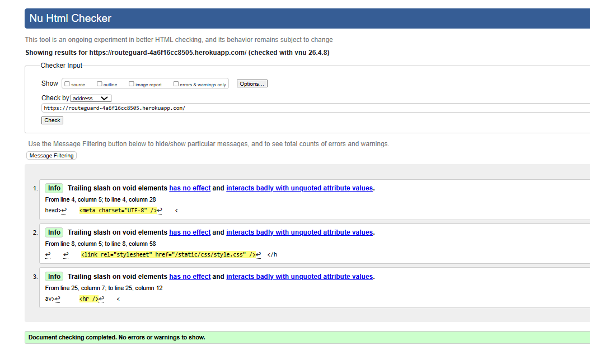

HTML templates were tested using the W3C Markup Validation Service. Minor issues were identified and corrected during development.

### CSS Validation

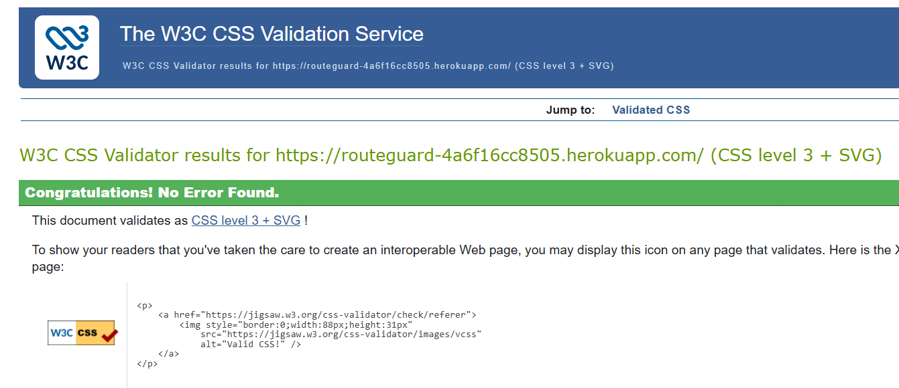

The stylesheet was tested using the W3C CSS Validation Service to confirm valid CSS syntax.

### Lighthouse Testing

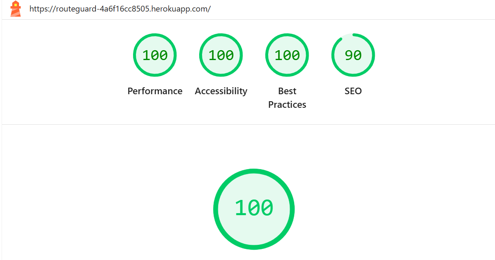

Lighthouse testing was carried out in Chrome Developer Tools to review performance, accessibility, best practices, and SEO. The results helped identify frontend improvements and confirm that the site follows good usability standards.

---

## Deployment

The application was deployed to Heroku using Git and the Heroku CLI.

### Deployment Steps

1. Created a Heroku application
2. Added deployment-related packages including:
   - `gunicorn`
   - `whitenoise`
   - `dj-database-url`
3. Updated `requirements.txt` to ensure all dependencies were included
4. Created a `Procfile` to define the web process:

```Procfile
web: gunicorn config.wsgi
```

1. Updated `settings.py` for deployment by:
   - moving `SECRET_KEY` to an environment variable
   - controlling `DEBUG` with an environment variable
   - adding Heroku-compatible `ALLOWED_HOSTS`
   - configuring static files using `STATIC_ROOT`
2. Added Heroku config vars for:
   - `SECRET_KEY`
   - `DEBUG`
3. Removed the local virtual environment folder from version control and added `.venv/` to `.gitignore`
4. Pushed the project to Heroku using:

```bash
git push heroku main
```

1. Ran migrations on the deployed application
2. Tested the live application to ensure that pages, authentication, CRUD features, validation, and styling all worked as expected

#### Environment Variables

The following environment variables were used in deployment:

- `SECRET_KEY`
- `DEBUG`

#### Notes

The production version uses a different environment from local development, so several deployment-specific issues had to be resolved before the application ran correctly on Heroku.

---

## Credits

- Django documentation
- Code Institute learning materials
- Online resources and tutorials used for guidance
- Visual Studio Code was used as the primary development environment, including features such as IntelliSense and auto-completion to support efficient coding
- Django documentation, particularly guidance on ModelForms, form validation, and querying related models
- Django Authentication System (`django.contrib.auth`) used for login, logout, and user management  
- Django `@login_required` decorator used to protect restricted views  
- Heroku documentation and deployment guidance
- Django documentation, particularly guidance on production settings and static files
- Django documentation was used for guidance on template logic, including conditional rendering and use of `request.path` within templates
- CSS styling guidance for table row striping using the `:nth-child` pseudo-class was referenced from GeeksforGeeks
- VS Code Markdown Preview tools were used to review README formatting and structure
- markdownlint was used to help improve README structure and formatting consistency
- Markdown Preview Mermaid Support was used to assist with previewing and checking markdown formatting during README development

---

## Challenges Faced & Solutions

### Template Structure and Inheritance Issues

During development, an issue occurred where Django could not locate the base template (`TemplateDoesNotExist: base.html`). This was caused by an incorrect configuration of template directories and inconsistent file structure between project-level and app-level templates.

**To resolve this:**

- A global `templates` directory was configured in `settings.py` using the `DIRS` setting
- App-specific templates were organised into `planner/templates/planner/`
- The `base.html` file was placed in the root templates directory to allow reuse across the application

This ensured that template inheritance using `` functioned correctly.

---

### Static Files Not Loading

The application initially failed to apply CSS styling despite correct linking in the template. This was due to Django not recognising the static files directory.

**To resolve this:**

- `` was added to the base template
- Static file paths were corrected using ``
- The `STATICFILES_DIRS` setting was added in `settings.py` to define the static file location

This ensured that static assets were correctly loaded and applied during development.

---

### File Structure Organisation

An early issue involved incorrectly placing static files within the templates directory. This prevented Django from properly distinguishing between templates and static assets.

**To resolve this:**

- Static files were moved into a dedicated `static/` directory
- Templates were kept strictly within `templates/` directories
- A clear separation between HTML structure and CSS styling was established

This improved maintainability and aligned the project with Django best practices.

---

### URL Routing Configuration

Initially, the homepage failed to render due to missing URL configuration between the project and the application.

**To resolve this:**

- A `urls.py` file was created within the `planner` app
- The home view was mapped using `path('', views.home, name='home')`
- The app URLs were included in the main `config/urls.py` file using `include()`

This enabled correct routing and navigation within the application.

---

### Template Rendering Output Issues

At one stage, the application displayed a blank page despite no visible errors. This was due to the absence of a `` placeholder in the base template.

**To resolve this:**

- A `` section was added to `base.html`
- This allowed child templates to correctly inject content into the layout

This reinforced understanding of Django’s template inheritance system.

---

### Key Learning Outcomes

Through resolving these issues, several important development concepts were reinforced:

- The importance of correct file structure in Django projects
- How Django locates and renders templates and static files
- The role of `settings.py` in configuring application behaviour
- The relationship between views, templates, and URL routing
- Debugging techniques using error messages and browser developer tools

These challenges strengthened understanding of Django’s architecture and contributed to the development of a more robust and maintainable application.

---

### Data Not Displaying in Templates

During development, an issue occurred where database records (e.g. assignments) were not appearing in the frontend templates, despite being present in the Django admin panel.

This was caused by inconsistencies between views, templates, and URL routing.

**To resolve this:**

- Ensured that querysets were correctly retrieved in views using `.objects.all()`
- Passed data to templates using context dictionaries (e.g. `{"assignments": assignments}`)
- Verified that template variable names matched those passed from the view
- Checked URL routing to ensure the correct views were being rendered
- Used debug techniques such as displaying object counts in templates

This improved understanding of how Django connects the database, views, and templates.

---

### Missing Form Import in View

During development of the driver creation feature, a `NameError` occurred because `DriverForm` had not been imported into `views.py`.

**To resolve this:**

- The form was defined in `forms.py` using a Django `ModelForm`
- The missing import statement `from .forms import DriverForm` was added to `views.py`

This reinforced the importance of correctly connecting Django forms, views, and templates when building CRUD functionality.

---

### Missing Redirect Import in View

During testing of the driver creation feature, a `NameError` occurred because `redirect` had not been imported into `views.py`.

**To resolve this:**

- The import statement was updated from `from django.shortcuts import render`  
  to `from django.shortcuts import render, redirect`

This ensured that successful form submissions could redirect users back to the relevant list page after saving data.

---

### Form Handling and View Integration Issues

During implementation of frontend forms, errors occurred when submitting data due to missing imports and incomplete view configuration.

Issues included:

- `ModelForm` classes not being imported into `views.py`
- Missing `redirect` import when handling successful form submissions
- Incorrect handling of POST requests

**To resolve this:**

- Imported forms using `from .forms import DriverForm, RouteForm, AvailabilityForm, AssignmentForm`
- Updated Django shortcuts import to include `redirect`
- Ensured correct conditional handling of request methods (`GET` vs `POST`)

This reinforced understanding of how Django processes form submissions and connects forms, views, and templates.

---

### Edit View Errors and Debugging

While building the driver edit (update) functionality, I ran into a couple of issues related to URL parameters and missing imports.

#### Issues encountered

- A `TypeError` occurred:  
  `edit_driver() got an unexpected keyword argument 'driver_id'`

This happened because the URL was passing `driver_id`, but the view function was expecting a different parameter name.

- I also forgot to import `get_object_or_404` in `views.py`, which caused another error when trying to retrieve the driver.

#### How I fixed it

- Updated the view function to match the URL parameter:

```python
def edit_driver(request, driver_id):
```

- Made sure the parameter name matched exactly between `urls.py` and `views.py`
- Added the missing import:

```python
from django.shortcuts import get_object_or_404
```

#### Edit View Outcome

- The edit page now loads correctly and allows existing drivers to be updated
- Improved my understanding of how Django passes URL parameters into views
- Reinforced the importance of consistent naming and remembering required imports

---

### Availability Delete URL Error

During implementation of delete functionality for availability records, a `NoReverseMatch` error occurred:

`Reverse for 'delete_availability' not found`

This was caused by a mismatch between the URL name defined in `urls.py` and the name referenced in the template.

**To resolve this:**

- Ensured the URL pattern included:

```python
name="delete_availability"
```

- Verified that the template used the exact same name:

```django

```

- Confirmed all files were saved and the development server was reloaded

This reinforced the importance of consistent naming between Django views, URLs, and templates.

---

### Incorrect Messages Import

While implementing user feedback messages, an `ImportError` occurred when attempting to run the server:

`ImportError: cannot import name 'messages' from 'django.shortcuts'`

This was caused by incorrectly importing `messages` from `django.shortcuts` instead of the correct Django module.

**To resolve this:**

- Updated the import statements in `views.py`:

```python
from django.shortcuts import render, redirect, get_object_or_404
from django.contrib import messages
```

- Restarted the development server to apply changes

#### Messages Import Outcome

- Success messages were displayed correctly after create, update, and delete actions
- Improved understanding of Django module structure and correct import usage

---

## Additional Deployment Challenges

### Deployment Issue: Missing `dj_database_url`

While preparing the application for deployment, the local server failed to run after `dj_database_url` was imported into `settings.py`.

The error occurred because the package had been referenced before it had been installed into the virtual environment.

**To resolve this:**

```bash
pip install dj-database-url
```

- Regenerated `requirements.txt`
- Retested the application locally before redeploying

This reinforced the importance of keeping installed dependencies aligned with imports used in the project settings.

---

### Deployment Issue: Virtual Environment Included in Repository

When pushing the project to Heroku, the build was rejected because the local `.venv` directory had been committed to the Git repository.

Heroku does not allow local virtual environments to be deployed because they are machine-specific.

**To resolve this:**

```bash
git rm --cached -r .venv
```

- Added `.venv/` to `.gitignore`
- Recommitted the changes and pushed again

This reinforced the importance of excluding local environment files from deployment.

---

### Deployment Issue: Static Files Configuration Error

During deployment, Heroku failed while running `collectstatic`.

This was caused by incomplete static files configuration in `settings.py`, particularly the missing `STATIC_ROOT` setting required for production.

**To resolve this:**

```python
STATIC_URL = "/static/"
STATIC_ROOT = BASE_DIR / "staticfiles"
STATICFILES_DIRS = [BASE_DIR / "static"]
```

- Retested static file handling before redeploying

This improved understanding of the differences between local and production static file handling.

---

### Deployment Issue: Gunicorn Not Installed

After deployment, the application crashed because Heroku could not find the Gunicorn web server.

**To resolve this:**

```bash
pip install gunicorn
```

- Updated `requirements.txt`
- Redeployed the application

---

### Deployment Issue: Missing WhiteNoise Dependency

After adding `WhiteNoiseMiddleware`, the application crashed with a `ModuleNotFoundError`.

**To resolve this:**

```bash
pip install whitenoise
```

- Updated `requirements.txt`
- Redeployed the application

---

### Deployment Issue: Application Crash After Successful Build

At one stage, the project deployed successfully but still showed a Heroku error page.

This required checking logs:

```bash
heroku logs --tail
```

**To resolve this:**

- Identified runtime errors from logs
- Installed missing dependencies
- Redeployed until successful

This demonstrated the importance of distinguishing between build success and runtime success.

---

## Deployment Insight

The production deployment process required additional configuration beyond local development, including:

- Environment variables
- Static file handling
- Dependency management
- Heroku-specific deployment setup

## Conclusion

RouteGuard was successfully developed and deployed as a full-stack Django application that supports real-world logistics planning tasks. The project includes full CRUD functionality, authentication, validation, user feedback, and deployment to a live environment.

Throughout development and deployment, several issues were identified and resolved, strengthening the final application and improving understanding of Django, Git, and Heroku workflows.

Future improvements have been identified to expand the project further, particularly around more advanced driver-hours logic and planning intelligence.
